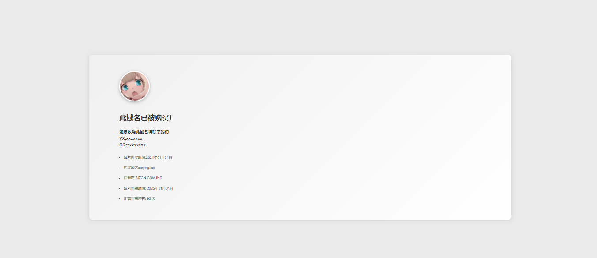

## 域名信息页面

一款用HBuilderX创作的域名信息页面+美丽的404页面

创作感想来源于---宝塔面板(bt.cn) 自动创建的页面

源码用途：当域名不常用时或出售可以使用此页面

**本项目已适配手机端**

域名信息页面 （展示图片）
--------

**页面介绍**

懒得介绍了，看图片吧，使用了自己去扒代码！！！细节还是很多的

懒得介绍了，看图片吧，使用了自己去扒代码！！！细节还是很多的

懒得介绍了，看图片吧，使用了自己去扒代码！！！细节还是很多的

懒得介绍了，看图片吧，使用了自己去扒代码！！！细节还是很多的

404页面 （展示图片）
--------

**页面介绍**

懒得介绍了，看图片吧，使用了自己去扒代码！！！细节还是很多的

懒得介绍了，看图片吧，使用了自己去扒代码！！！细节还是很多的

懒得介绍了，看图片吧，使用了自己去扒代码！！！细节还是很多的

懒得介绍了，看图片吧，使用了自己去扒代码！！！细节还是很多的

